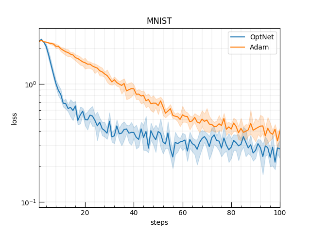

# [Learning to Learn](https://arxiv.org/abs/1606.04474) in Chainer

A chainer implementation of "[Learning to learn by gradient descent by gradient descent](https://arxiv.org/abs/1606.04474)" by Andrychowicz et al.
It trains and tests an LSTM-based optimizer which has learnable parameters transforming a series of gradients to an update value.



### What is LSTM-based optimizer?

SGD is a simplest transformation of gradient; just multiplying a gradient with a constant value of learning rate.
Momentume SGD or more sophiscated ones like Adam use a series of graadients.
Finally, this LSTM-based optimizer is a general case of them.
While they define update formula in advance (by hand), the LSTM-based optimizer learns the formula, i.e, how to merge a history of gradients to reach convergence efficiently.


### Dependencies

See `requirements.txt`

- chainer>=6.0.0
- cupy>=6.0.0
- seaborn==0.9.0


## Training

This repository includes an experiment using a fully connected network on MNIST.

```
python train_mnist.py -g 0
```

The script trains an LSTM-based optimizer as follows

```
init optimizer
for-loop
  init model
  for-loop
    update model by optimizer
    update optimizer by Adam (at every 20 steps)
  test optimizer (through another training of models)
  save optimizer if it is best
```


## Citation

```
@incollection{NIPS2016_6461,
  title = {Learning to learn by gradient descent by gradient descent},
  author = {Andrychowicz, Marcin and Denil, Misha and G\'{o}mez, Sergio and Hoffman, Matthew W and Pfau, David and Schaul, Tom and Shillingford, Brendan and de Freitas, Nando},
  booktitle = {Advances in Neural Information Processing Systems 29},
  year = {2016},
  url = {http://papers.nips.cc/paper/6461-learning-to-learn-by-gradient-descent-by-gradient-descent.pdf}
}
```
